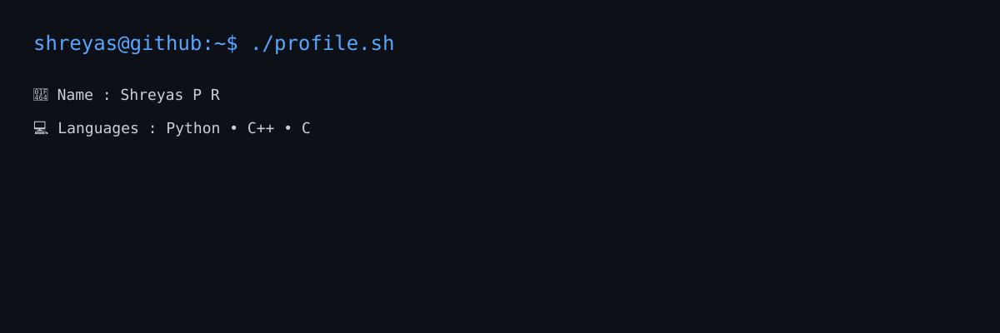

  

# 💫 About Me

# Hey 👋, I'm Shreyas P R

**Student | Community Builder | Tech Enthusiast**

I'm passionate about building communities, exploring technology, and creating opportunities for people to learn, connect, and grow together.

- 🚀 Organizing and volunteering at tech events
- 💻 Building projects and experimenting with new ideas
- 🤝 Connecting people, communities, and opportunities
- 📚 Continuously learning and sharing knowledge

I believe that impactful technology comes from a combination of great ideas, strong execution, and collaborative communities.

Always open to collaborations, interesting projects, and meaningful conversations.

## 🌐 Socials

# 💻 Tech Stack

### 👨‍💻 Programming Languages

### 🎨 Frontend

### ⚙️ Backend & APIs

### 🗄️ Databases

### ☁️ Cloud & Deployment

### 🛠️ DevOps & Tools

### 📊 Data & Visualization

### 🎨 Design

### 🔧 Hardware & Networking

# 📊 GitHub Activity

### 🔥 Contribution Streak

  

## 🏆 GitHub Trophies

  

## 🐍 Contribution Snake

  

## 📈 Contribution Graph

### ✍️ Random Dev Quote

  

### 🔝 Top Contributed Repositories

  

---

  

  <b>Keep Building. Keep Learning. 🚀</b>

